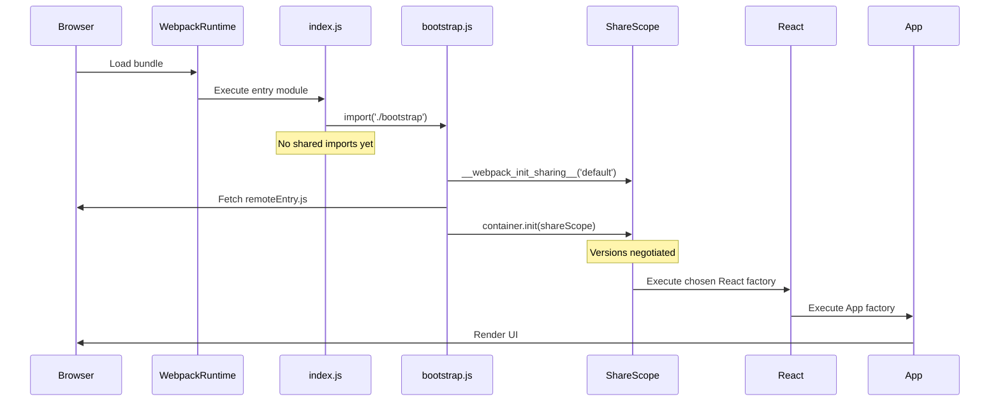

# Why Module Federation Requires a `bootstrap` Entry (and Native ESM Does Not)

This document explains **why Webpack Module Federation requires a dynamic `bootstrap` entry**, what problem it solves, and why the same thing **cannot be done with native ESM**.

This is not stylistic. It is a **hard technical constraint**.

---

## 1. The Core Problem Module Federation Must Solve

Module Federation must guarantee:

> **Only one instance of a shared module (e.g. React) executes across host and remotes.**

To do that, Webpack must:

1. Discover all shared modules (local + remote)
2. Load remote containers (network)
3. Negotiate versions (`singleton`, `strictVersion`, `requiredVersion`)
4. Decide **which factory wins**
5. Execute exactly one factory

**Once a module factory executes, it cannot be undone.**

Therefore:

> **No shared module factory may execute before share-scope negotiation finishes.**

---

## 2. Why the Entry Module (`index.js`) Is the Problem

Example entry:

```js
import React from 'react';
import App from './App'; `
```

Facts:

-   Static imports are resolved before any runtime code

-   Webpack cannot pause the entry module

-   React's factory executes immediately

-   Share scope is still uninitialized

-   Remote React (if any) arrives later → duplicate React → broken app

There is **no legal place in JavaScript** to `await` before static imports in the entry module.

So the entry module is too late.

* * * * *

3\. What the Dynamic `bootstrap` Import Fixes
---------------------------------------------

Entry module:

```js
// index.js
import('./bootstrap');
```

This does one critical thing:

It creates an **async boundary before any shared imports exist**.

At this point:

-   No React

-   No App

-   No shared factories executed

Webpack has full control.

This async boundary is the **only leverage point** Webpack gets.

* * * * *

4\. What Happens Inside `bootstrap.js`
--------------------------------------

Example:

```js 
import React from "react";
import ReactDOM from "react-dom/client";
import App from "./App";
```

When `bootstrap.js` is dynamically imported:

### What does happen

-   Module is fetched and parsed

-   Static imports are registered

-   Webpack knows `bootstrap` depends on:

    -   `react`

    -   `react-dom`

    -   `./App`

### What does NOT happen

-   Shared module factories (`react`, `react-dom`) are **not executed yet**

This deferment is **Webpack Module Federation behavior**, not native ESM.

* * * * *

5\. Why Some Imports Execute Immediately and Others Don't
---------------------------------------------------------

```js
import React from "react";                // shared
import ReactDOM from "react-dom/client";  // shared
import App from "./App";                  // not shared
import { loadRemoteEntry } from "./runtime/loadRemoteEntry";`
```
Execution rules:

**Shared modules**\
→ execution deferred until share scope is finalized

**Non-shared modules without shared deps**\
→ execute immediately

**Modules that depend on shared modules (e.g. App)**\
→ execution is transitively blocked

Webpack blocks execution like this:

```js
App
 └── react (shared, unresolved)
 ```

Since JS modules cannot partially execute, `App` must wait too.

* * * * *

6\. Why `__webpack_init_sharing__` Must Run First
-------------------------------------------------

```js
await __webpack_init_sharing__("default");
await loadRemoteEntry(...);
await container.init(__webpack_share_scopes__.default);
```

This sequence:

-   Creates the share scope

-   Loads remote containers

-   Merges shared metadata

-   Resolves version conflicts

-   Picks winning factories

Only after this can React safely execute.

* * * * *

7\. Execution Sequence Diagram
------------------------------



* * * * *

8\. Why the `bootstrap` Function Is NOT the Key
-----------------------------------------------

This is **not** why it works:

```js
async function bootstrap() { ... }
bootstrap();
```

The function is incidental.

What matters:

-   The **module itself** was dynamically imported

-   That delayed **module evaluation**, not function execution

If `bootstrap.js` were statically imported, this would fail even with `async/await`.

* * * * *

9\. Why This Is Impossible with Native ESM
------------------------------------------

Native ESM:

```js
import('./bootstrap.js');`

Inside `bootstrap.js`:

import React from 'react';
```

Behavior:

-   Browser fetches module

-   Parses it

-   Instantiates and evaluates static imports immediately

-   React executes immediately

There is **no hook** to defer execution.

Top-level `await`:

-   Pauses *your* module

-   Does **not** pause execution of its dependencies

So:

> **Native ESM cannot defer execution of static imports.**

* * * * *

10\. Why Webpack Can Do This
----------------------------

Webpack does **not** use the browser's module loader.

Instead:

-   Every module is a JS factory function

-   Execution is explicit (`__webpack_require__`)

-   Webpack controls **when** a factory runs

-   Dynamic import gives Webpack a place to pause and decide

Native ESM does not.

* * * * *

11\. Gotchas for Future Maintainers
-----------------------------------

Do **NOT**:

-   Add static imports to `index.js`

-   Import React (or any shared dep) before `bootstrap`

-   Remove the dynamic `import('./bootstrap')`

-   Assume `await` inside a function is sufficient

-   Convert `bootstrap` to a static import "for cleanliness"

Be careful when:

-   Adding new shared dependencies\
    → ensure they are only imported inside `bootstrap` or deeper

-   Refactoring entry points\
    → `index.js` must stay minimal

-   Migrating to native ESM\
    → this pattern does **NOT** translate directly

Safe mental check:

> "Could this import cause a shared module to execute before share negotiation?"

If yes --- it does not belong in the entry module.

* * * * *

12\. One-Line Rule (Memorize This)
----------------------------------

> **If a shared module might be used, its first appearance must be inside a dynamically imported module.**

* * * * *

13\. Summary
------------

-   `index.js` cannot be delayed → unsafe for shared modules

-   Dynamic `import('./bootstrap')` creates a pre-main phase

-   Webpack uses that phase to finalize the share scope

-   Shared factories execute only after negotiation

-   Native ESM cannot do this at all

This is a **language constraint**, not a design choice.
